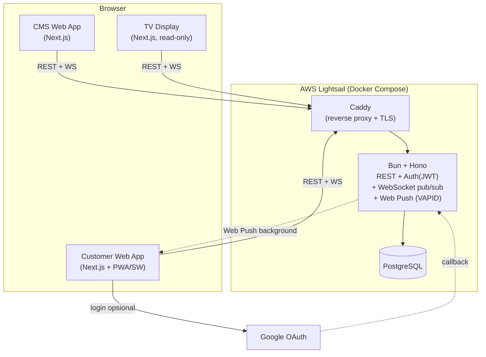
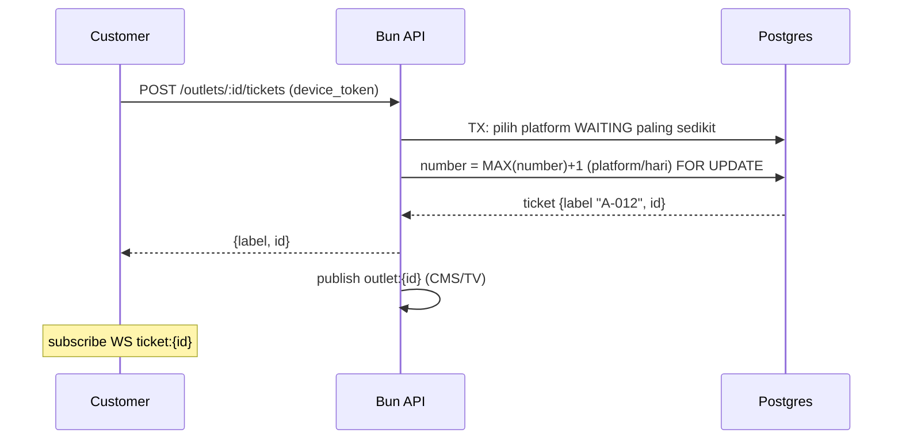
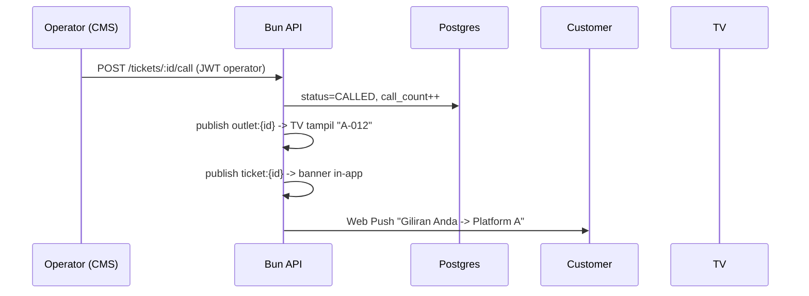
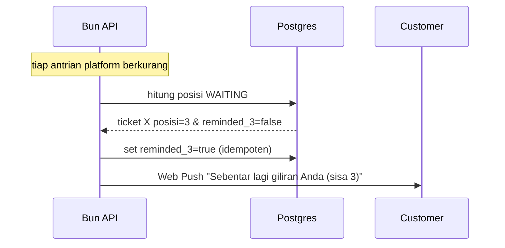
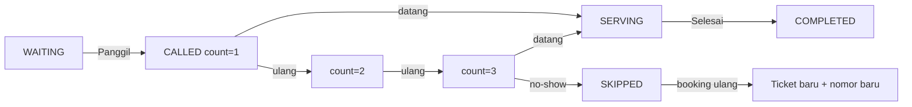
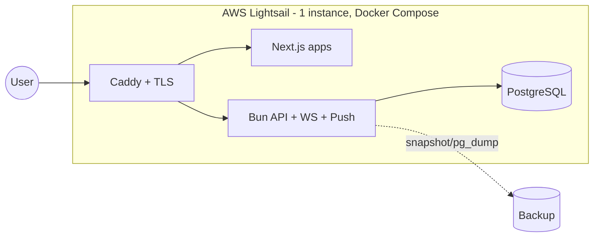

# System Design — Queue Management System

> Pendamping: `01-PRD`, `02-TDD`. Stack: **Next.js + Bun + PostgreSQL (AWS Lightsail)**. Auth & Realtime dibangun sendiri.

---

## 1. Arsitektur Komponen

---

## 2. Tanggung Jawab Komponen

| Komponen | Tanggung jawab |
|----------|----------------|
| **CMS Web App** | Manajemen outlet/platform/user/operator, monitor live, panel operator (call/skip). |
| **Customer Web App** | Ambil antrian (web/QR) dengan auto-assign platform, tampilkan posisi, daftar push, terima notifikasi. |
| **TV Display** | Layar publik per outlet: nomor "sedang dipanggil" per platform, update live. |
| **Caddy** | Reverse proxy + HTTPS otomatis. |
| **Bun API** | Semua mutasi & logika: auto-assign platform, penomoran atomic, state machine, JWT auth, WebSocket pub/sub, trigger push. |
| **PostgreSQL** | Penyimpanan data (di Docker pada instance, atau Lightsail Managed DB). |

---

## 3. Alur Data Utama

### 3.1 Ambil Antrian + Auto-assign Platform (CUS-1)

### 3.2 Operator Memanggil (CMS-4 → CUS-6)

### 3.3 Reminder "Sisa 3" (CUS-5)

### 3.4 Skip & Ambil Ulang (CMS-4 / CUS-7)

---

## 4. Strategi Realtime (Bun WebSocket)

- **CMS & TV** subscribe topic `outlet:{id}` → semua perubahan ticket outlet itu.
- **Customer** subscribe topic `ticket:{id}` → status & posisi dirinya.
- Auth pada koneksi: JWT (CMS/operator) / token ticket (customer).
- **Web Push** menutup kasus tab tertutup/background.

---

## 5. Konkurensi & Keandalan

- **Auto-assign + penomoran atomic** (TX + `FOR UPDATE`/sequence) → tak ada nomor dobel / salah platform saat bersamaan.
- **Idempotensi reminder** via flag `reminded_3`.
- **Fallback snapshot** `GET /outlets/:id/queue` bila WS putus.
- **Audit** di `ticket_events`.
- **Scoping multi-tenant di aplikasi** (tanpa RLS) — wajib difilter `client_id`/`operator_outlets` di repo layer.

---

## 6. Topologi Infrastruktur (Semua Lightsail, Hemat)

- Semua service dalam 1 instance Lightsail via Docker Compose.
- Backup: Lightsail automatic snapshots + cron `pg_dump`.
- Scale Phase 2: pisahkan Postgres ke Lightsail Managed DB; tambah instance + load balancer.
- *(Opsional)*: Next.js dapat dipindah ke Vercel free tier untuk mengurangi beban instance.
